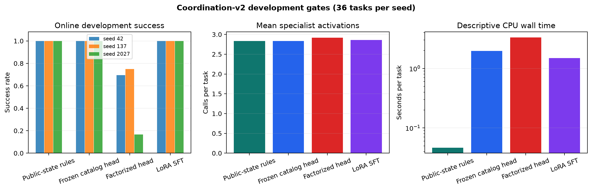
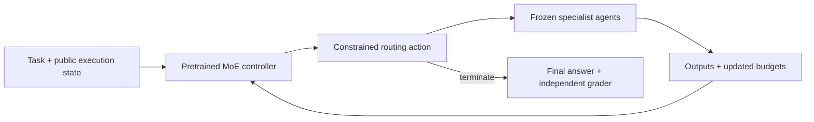

# Conductor

**Can a pretrained sparse MoE learn to coordinate frozen specialist agents?**

[](https://github.com/darshgarg7/Conductor/actions/workflows/tests.yml)

Conductor treats multi-agent routing as a post-training problem. A pretrained
Mixture-of-Experts controller reads the task and public execution state, chooses
up to `k` specialists, decides whether they run in parallel or sequence, and
routes again after their outputs update the state. Only the controller is
trained; the specialist agents remain frozen.

The repository contains the training pipeline, controlled workflow generator,
baselines, inference benchmarks, HTTP serving path, SLURM jobs, and published
measurements. Results stay in the repository even when a learned policy loses.

[Latest study](results/coordination-v2/report.md) ·
[Original failure and repair](docs/routing_failure_analysis.md) ·
[Research protocol](docs/coordination_v2_protocol.md) ·
[Code review guide](docs/review_guide.md) ·
[NVIDIA/HPC validation](docs/hpc.md)

## Current result

Coordination-v2 is a three-seed CPU study on six controlled workflow families.
It was designed after the original learned policies collapsed on unseen task
compositions.

| Development policy | Seed 42 | Seed 137 | Seed 2027 | Mean calls |
| --- | ---: | ---: | ---: | ---: |
| Public-state rules | 36/36 | 36/36 | 36/36 | 2.83 |
| Frozen Granite + fitted catalog head | 36/36 | 36/36 | 36/36 | 2.83 |
| Frozen Granite + factorized head | 25/36 | 27/36 | 6/36 | 2.92 |
| Granite LoRA SFT | 36/36 | 36/36 | 36/36 | 2.86 |



The SFT stage updates 942,565 of 1,335,567,845 controller parameters with
rank-four LoRA on attention and expert-router projections plus the coordination
head. Saved checkpoints show changes in all 144 adapter tensors for every seed.
The 108-task data inventory contains 540 measured trajectories, with initial,
intermediate, handoff, failure, stopping, multi-agent, parallel, and sequential
supervision.

The study stopped at its predeclared DPO eligibility gate. Greedy SFT rollouts
produced no training preference pairs for seeds 42 and 137, and two for seed
2027. The code therefore did not train DPO or generate the fresh 120-task final
suite. Development data selected the representation and training path, so the
36/36 values are development results rather than held-out generalization.

This outcome establishes a reproducible multi-seed MoE SFT implementation. It
also shows that the rule router is the right policy for this fixture: it matches
quality and activation count with much lower CPU overhead. The result does not
support a DPO improvement, inference-cost reduction, NVIDIA performance, or
production-readiness claim. The [published archive](results/coordination-v2/)
contains checksums, per-task metrics, coverage audits, seed outcomes, provenance,
and the blocked-stage decision.

## System design



The controller input contains:

```text
user_task                 previous_agent_outputs
conversation_state        agents_already_called
tool_results              remaining_budget
current_step              previous_routing_decisions
```

Private answers, workflow-family labels, required routes, and grader scores stay
outside the controller and specialist boundary.

A routing action contains selected agents, execution mode, confidence, and a
termination flag. The categorical control represents every valid complete
action directly; with eight agents and `k=3`, it has 485 actions. The factorized
head implements a normalized joint policy over:

```text
stop → number of agents → execution mode → agents without replacement
```

Agent top-k is separate from Granite's internal neural expert routing. Reducing
specialist calls does not change the backbone's per-token expert count.

Eight agent interfaces cover planning, retrieval, research, code, tools,
criticism, verification, and math. The coordination-v2 specialists are
deterministic capability fixtures so route behavior is reproducible. Local
open-weight and OpenAI-compatible agent backends are also configurable.

## What is implemented

- **Pretrained sparse-MoE control:** pinned Granite backbone, constrained action
  heads, expert instrumentation, attention/router LoRA, and frozen specialists.
- **Training:** SFT, exact-reference categorical DPO, explicit development data,
  gradient accumulation, atomic checkpoints, exact resume, and CPU/Gloo or
  CUDA/NCCL distributed execution.
- **Data and evaluation:** durable trajectory journals, state-matched
  counterfactuals, group-disjoint splits, workflow contract grading, strong
  cheap controls, paired metrics, and machine-readable audits.
- **Inference:** native batching, bounded dynamic batching, state/tokenization
  caches, mixed precision, NVTX ranges, latency distributions, throughput,
  process/GPU memory, and controller-overhead accounting.
- **Serving:** one model owner per worker, bounded admission, authentication,
  request limits, deadlines, readiness, shutdown, and load-test clients.
- **HPC:** SLURM scripts for generation, SFT, DPO, evaluation, sweeps, and
  inference benchmarks, plus an NGC-based NVIDIA container recipe.

The [review guide](docs/review_guide.md) points to the shortest path through the
implementation. Design tradeoffs and rejected shortcuts are recorded in
[design decisions](docs/design_decisions.md).

## Reproduce locally

The tested environment uses Python 3.12. From the repository root:

```bash
python3.12 -m venv .venv
source .venv/bin/activate
python -m pip install -e '.[dev,hf,serve,profiling]'
ruff check .
pytest -q
```

### Coordination-v2 stages

The executable study config is separate from the immutable pre-run protocol.
Run each gate in order:

```bash
python -m conductor.coordination.study \
  --config configs/research/coordination_v2_study.yaml --stage data

python -m conductor.coordination.study \
  --config configs/research/coordination_v2_study.yaml --stage cheap

python -m conductor.coordination.study \
  --config configs/research/coordination_v2_study.yaml --stage probe

python -m conductor.coordination.study \
  --config configs/research/coordination_v2_study.yaml --stage sft

python -m conductor.coordination.study \
  --config configs/research/coordination_v2_study.yaml --stage preferences

python -m conductor.coordination.study \
  --config configs/research/coordination_v2_study.yaml --stage dpo
```

Each stage consumes saved artifacts from the previous gate. A failed gate writes
a blocked summary and does not silently select another seed, pool data, or
manufacture labels. Working data and checkpoints remain under ignored
`data/coordination-v2/` and `outputs/coordination-v2/` directories. Rebuild the
recorded public archive with:

```bash
python scripts/report_coordination_v2.py
```

The report script is pinned to the recorded input fingerprint and refuses to
apply this interpretation to different measurements.

### Lightweight end-to-end path

```bash
bash scripts/run_dev.sh
```

This runs generation, SFT, DPO, evaluation, inference benchmarks, and analysis
with a small randomly initialized MoE. It validates the plumbing without a
pretrained-model download. Outputs go under `data/dev/` and `outputs/`.

### HTTP support demonstration

```bash
bash scripts/run_support_demo.sh
```

The demo connects trained routing to fixed read-only support specialists and
reports diagnostic correctness separately from HTTP service acceptance. In the
recorded CPU fixture, rules satisfy 12/12 diagnostic contracts and the learned
policies satisfy 0/12, so the acceptance gate rejects them. See the
[walkthrough](docs/demo_walkthrough.md) and [raw report](results/support-demo/report.md).

## Inference and NVIDIA validation

The benchmark separates offline batches, queued single requests, and compatible
dynamic batches. It records requests/second, tokenizer tokens/second,
queue-inclusive p50/p95 latency, controller overhead, and memory. The original
CPU study found no batching speedup; at batch limit four and concurrency four,
dynamic batching reached 0.843× the single-request throughput and 1.133× its p95
latency. Those measurements remain published in the
[Granite pilot](results/granite-pilot/report.md).

CUDA paths add event timing, allocated/reserved memory, NVTX profiling, mixed
precision, and distributed NCCL training. They have not been run on an NVIDIA
host in this project. Validate them on target hardware before making a GPU,
capacity, or cost claim:

```bash
python -m conductor.doctor \
  --device cuda:0 --dtype bfloat16 --require-cuda --probe

bash scripts/validate_nvidia.sh \
  configs/inference/nvidia.yaml CHECKPOINT

sbatch scripts/slurm/distributed_sft.slurm \
  configs/training/olmoe_sft.yaml
```

The [NVIDIA deployment guide](docs/deployment.md), [HPC notes](docs/hpc.md), and
[NGC container](containers/Dockerfile.nvidia) define the validation path.

## Experiment history

| Study | Outcome | Evidence |
| --- | --- | --- |
| Original Granite pilot | SFT 2/6, DPO 2/6; learned policies collapse to coder → stop | [Report](results/granite-pilot/report.md) |
| Routing repair | SFT/DPO 32/48, comprising 32/32 seen templates and 0/16 unseen compositions; rules 48/48 | [Report](results/routing-repair/report.md) |
| Coordination-v2 | Three-seed SFT reaches 36/36 development tasks; factorized head fails; DPO and final suite blocked | [Report](results/coordination-v2/report.md) |

The progression matters more than the best number. The first study exposes
policy collapse. The repair exposes template memorization. Coordination-v2 adds
real dependencies, richer supervision, multiple seeds, stronger controls, and
frozen advancement rules; it then exposes an on-policy data-collection problem.

## Repository map

| Area | Entry point |
| --- | --- |
| Controller and action heads | [`conductor/controller/`](conductor/controller/) |
| Frozen specialist interfaces | [`conductor/agents/`](conductor/agents/) |
| Coordination-v2 workflows and gates | [`conductor/coordination/`](conductor/coordination/) |
| SFT, DPO, resume, and probes | [`conductor/training/`](conductor/training/), [`conductor/preference/`](conductor/preference/) |
| Orchestration and state transitions | [`conductor/orchestration/`](conductor/orchestration/) |
| Evaluation and metrics | [`conductor/evaluation/`](conductor/evaluation/), [`conductor/metrics/`](conductor/metrics/) |
| Inference and serving | [`conductor/inference/`](conductor/inference/), [`conductor/serving/`](conductor/serving/) |
| Configurations and cluster jobs | [`configs/`](configs/), [`scripts/slurm/`](scripts/slurm/) |
| Published results | [`results/`](results/) |

## Scope

The published studies use synthetic workflows and deterministic specialists on
CPU. They measure routing behavior under controlled capability boundaries. They
do not establish general customer-task accuracy, savings, GPU performance, or
production capacity. Model weights and optimizer state are reproducible working
artifacts and are excluded from Git; public result archives retain hashes,
metrics, and provenance.

Conductor is available under the [MIT License](LICENSE).
