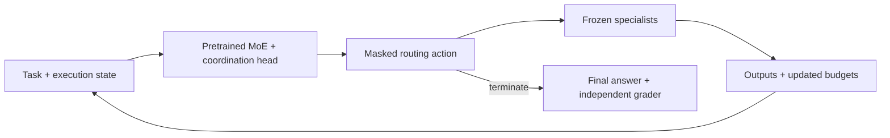
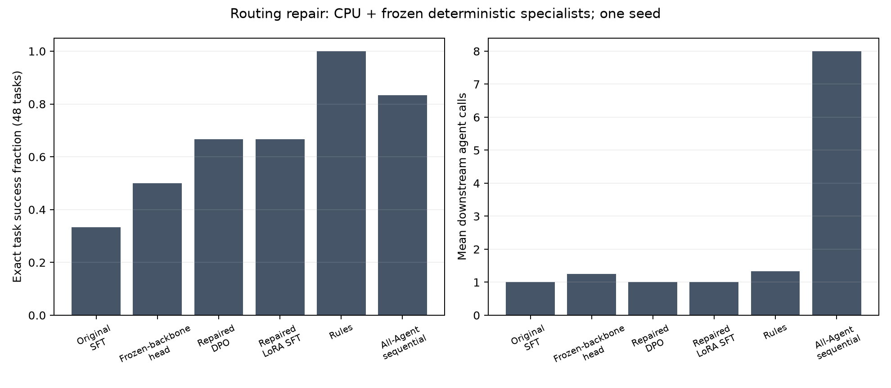

# Conductor

**Post-training a sparse MoE to select specialists, coordinate their work, and stop execution.**

[](https://github.com/darshgarg7/Conductor/actions/workflows/tests.yml)

Conductor asks whether a pretrained Mixture-of-Experts language model can learn
to activate fewer agents while preserving task success. The coordinator receives
a task and its execution state, predicts a constrained routing action, and
repeats after the selected specialists return their outputs.

Can a learned controller generalize to unseen coordination structures while matching dense execution quality with materially fewer specialist calls, and does MoE post-training outperform simpler routing models after including its own overhead?

Only the coordinator is post-trained. Specialist parameters stay frozen, so the
experiment measures the effect of changing the routing policy. The repository
contains an offline trajectory pipeline, LoRA SFT and categorical DPO, held-out
baseline evaluation, controller inference benchmarks, and a bounded HTTP service.

**Current evidence:** pretrained Granite CPU post-training with deterministic
specialists. A completed routing repair improves success over the original
checkpoints on the same 48 tasks, but fails every unseen composition and trails
rules and random routing. Neither study establishes inference savings or a need
for MoE. CUDA, NCCL, SLURM execution, and the NVIDIA container still need GPU-host
validation.

[Routing repair](results/routing-repair/report.md) ·
[Original pilot](results/granite-pilot/report.md) ·
[Failure analysis](docs/routing_failure_analysis.md) ·
[Customer scenario](docs/customer_case_study.md) ·
[Service demonstration](docs/demo_walkthrough.md) ·
[Design decisions](docs/design_decisions.md) ·
[Code review guide](docs/review_guide.md) ·
[Cluster setup](docs/hpc.md)

## Architecture



The head predicts a distribution over complete actions: which specialists to
call, their execution mode, and whether to terminate. Parallel actions select
an unordered subset; sequential actions preserve order so later specialists can
use earlier outputs. A mask enforces **at most k agents per step**, with k=1, 2,
or 3. The eight-specialist, k≤3 catalog contains 485 actions, including stopping.
Confidence is the selected action probability, not calibrated task-success probability.

The public state contains the task/type, conversation history, previous agent
outputs and calls, tool results, remaining budget, current step, and routing
history. Answer keys belong to the independent grader and never enter controller
inputs. [State serialization](conductor/schema.py) and
[the action catalog](conductor/controller/actions.py) define this boundary.

Eight interfaces cover planning, retrieval, research, coding, tool execution,
criticism, verification, and math. Development uses fixed deterministic fixtures;
[local HF](configs/agents/hf.yaml) and [API](configs/agents/api.yaml) specialist
backends are configurable.

**Agent top-k and neural expert top-k are independent.** Granite selects eight
of 32 internal experts per token. Reducing the number of downstream agent calls
does not reduce that internal expert count.

## Post-training

1. **Collect trajectories.** Dense, rule-based, and random policies produce
   successes and failures with agent outputs, budgets, communication graphs, and
   measured usage. Counterfactual replay compares candidate actions from the
   same public state under a fixed continuation.
2. **Supervised fine-tuning.** Train the coordination head and attention/router
   LoRA adapters on sparse routing labels. The repair curates measured
   counterfactual winners instead of labeling every successful path useful.
   Task IDs split fitting data from internal validation; held-out evaluation
   tasks remain separate.
3. **Preference optimization.** Categorical DPO compares chosen/rejected action
   log probabilities against the exact frozen SFT checkpoint. Cached reference
   probabilities avoid keeping a second pretrained backbone resident.

Preference rewards trade task success against normalized token usage, latency,
agent activations, and communication. Weights are configurable. The CPU pilot
uses zero latency weight to avoid learning from noisy fixture timings.
See the [experimental protocol](docs/research_protocol.md) for evaluation and
claim requirements.

## Measured CPU studies

Both studies use pinned `ibm-granite/granite-3.1-1b-a400m-base`, CPU float32 with
SDPA, eight fixed specialists, and common total budgets within each comparison.
The 1,335,567,845-parameter coordinator updates 942,565 parameters (0.07%): its
action head and rank-four attention/router LoRA adapters.

The **original pilot** solves 2/6 held-out tasks with SFT and 2/6 with DPO. Both
choose coder and then stop on every task. DPO improves offline preference ranking
without improving task success. Its prompted supervisor fails closed on invalid
decisions; that baseline does not establish superiority over a functioning
supervisor. The original measurements and subsequent dense sensitivity controls
remain in the [sealed pilot report](results/granite-pilot/report.md).

The **routing repair** compares original and repaired checkpoints on the same
new, locked 48-task inventory:

| Routing policy | Exact success on the same 48 tasks |
| --- | --- |
| Original SFT and DPO | 16/48 each |
| Frozen backbone with a fitted action head | 24/48 |
| Repaired LoRA SFT and DPO | 32/48 each |
| Rule-Based Router | 48/48 |
| Random Top-K | 39/48 |
| All-Agent: one sequential round | 40/48 |

Both repaired controllers solve **32/32 seen-template tasks and 0/16 unseen
compositions**. The repair combines preserved progress fields, a 256-token cap,
reward-curated supervision, more training data, and a validation-selected
masked-mean fitted head before LoRA. Original checkpoints retain their 128-token
inputs; this comparison does not isolate one causal change. DPO adds no task
success over repaired SFT, and the simpler controls remain stronger.

The 36 training tasks produce 108 reference trajectories. Curation yields 180
state labels and 360 preference pairs: SFT fits 135 states and reserves 45;
DPO fits 270 pairs and reserves 90, across the same 27/9 task partition. These
are distinct units, not independent sample counts to add together. Every chosen
label is stop or a single-agent call, and internal validation contains no math
task. The [repair report](results/routing-repair/report.md) preserves these gaps,
raw traces, comparisons, and failures; the
[repair protocol](docs/routing_repair_protocol.md) records its scope.



The original inference study measures 30 CPU configurations and 720 timed
requests over eight replayed states. It finds no reliable CPU batching/cache
gain. At batch limit four, concurrency four, and k=2, dynamic batching records
**0.843× throughput**
and **1.133× p95 latency** relative to queued individual inference. Grouped repeats
and host variation limit interpretation. Raw timings and matched comparisons are
in the [report](results/granite-pilot/report.md) and
[benchmark CSV](results/granite-pilot/phases/inference/benchmark.csv).

These are results on arithmetic, lookup, string transformations, and compositions
that share synthetic template families. Forty-eight related tasks and one seed
cannot establish broad generalization. HF controller tokens are actual tokenizer
counts; downstream tool tokens are estimates, and zero configured prices leave
monetary costs unknown. The [combined failure analysis](docs/routing_failure_analysis.md)
examines label coverage and generalization. The research hypothesis remains
unresolved.

## Run locally

Use **Python 3.12** for the tested environment. Run commands from the repository
root. Install the full test dependencies in a virtual environment:

```bash
python3.12 -m venv .venv
source .venv/bin/activate
python -m pip install -e '.[dev,hf,serve,profiling]'
ruff check .
pytest -q
```

HF/PEFT versions are pinned to the tested API. Install a suitable PyTorch build
for your target device; the local pilot uses CPU. Tests use small local model
fixtures without downloading the pretrained pilot weights.

### Walk through a customer workflow

```bash
bash scripts/run_support_demo.sh
```

The [GPU support triage scenario](docs/customer_case_study.md) connects the
trained routing HTTP service to fixed, read-only support specialists. Synthetic
tickets cover supported runbook symptoms and cases requiring more evidence.
Selected specialists execute, then their outputs return to the controller for
the next decision. No diagnostic command runs on the host.

The demonstration compares a support rule policy with the model policy and
records **diagnostic correctness separately from service acceptance**. It also
replays HTTP requests at concurrency one and four, preserving raw timings,
status codes, and configured latency-target outcomes. The default tiny path
needs no pretrained-model download; an existing Granite checkpoint can be used
instead. See the [walkthrough](docs/demo_walkthrough.md),
[recorded results](results/support-demo/report.md), and
[operations guide](docs/support_operations.md).

In the recorded CPU runs, rules satisfy **12/12** diagnostic contracts; both
learned candidates satisfy **0/12**. All **96** load requests return valid model
responses, but Granite's concurrency-four client p95 is **2.34 seconds**, above
the illustrative two-second target. `--require-model-acceptance` rejects a
candidate when service, diagnostic, or configured load acceptance fails. The
rules remain the recommendation for this fixed fixture; these results do not
establish independent customer accuracy or GPU capacity.

### Start with the tiny demo

```bash
bash scripts/run_dev.sh
```

This runs generation → SFT → DPO → evaluation → inference benchmarks → analysis
with a **randomly initialized tiny MoE** and deterministic tools. No model
checkpoint download or API key is required. The prompted supervisor is unavailable
in this configuration; six policies are measured. This validates the development
pipeline separately from the pretrained experiment.

Data goes to `data/dev/`; checkpoints go to `outputs/checkpoints/tiny-*`.
Evaluation, benchmarks, and analysis go to `outputs/evaluation/dev/`,
`outputs/benchmarks/dev/`, and `outputs/reports/dev/`. The script also runs a
separate precision/feature-cache study. Set `CONDUCTOR_PYTHON` if your interpreter
is outside `.venv/bin/python`.

### Reproduce pretrained post-training

```bash
bash scripts/run_granite_pilot.sh
```

This downloads pinned Granite and Qwen supervisor weights, then runs the CPU
post-training, seven-policy evaluation, replay benchmark, and analysis. Working
data goes to `data/generated/granite-pilot/`; runs and checkpoints go to
`outputs/research/granite-pilot/`. The pretrained model needs substantially more
memory than the tiny demo. Full merged export is an optional, memory-intensive check.

Use **fresh working output directories** for a new experiment. Fresh training
into an existing committed checkpoint directory is rejected. For an individual
compatible training run, resume explicitly with `python -m conductor.train
--config CONFIG --resume RESUME_DIRECTORY`. The convenience scripts do not
forward resume options. If relocating an experiment, update linked data,
checkpoint, evaluation, replay, and output paths together.

For individual stages and supplementary checks:

```bash
python -m conductor.generate --config configs/research/granite_generation.yaml
python -m conductor.train --config configs/training/granite_sft.yaml
python -m conductor.train --config configs/training/granite_preference.yaml
python -m conductor.evaluate --config configs/evaluation/granite_pilot.yaml
python -m conductor.benchmark --config configs/inference/granite_pilot.yaml
python scripts/verify_pilot_adapters.py
python scripts/smoke_serving.py --config configs/serving/granite_pilot.yaml
```

[Sequential dense controls](configs/evaluation/granite_dense_sequential.yaml),
[the two-round control](configs/evaluation/granite_strong_dense.yaml), and
`scripts/validate_pilot_export.py` are separate from the main pilot script.
The archive contains data and metadata, not executable model weights.

## Inference and NVIDIA validation

The benchmark separates native offline batches, queued individual requests, and
compatible dynamic batches. It measures input tokens/second, requests/second,
queue-inclusive p50/p95, stage overhead, and process memory. CUDA paths add event
timing, allocated/reserved memory, and NVTX ranges; profiler samples stay outside
throughput timing. State/tokenization caches are bounded. Generative KV-cache
reuse is not implemented for this classification path.

The HTTP service gives one worker exclusive ownership of each model. Admission
includes queued and in-flight work; compatible k values batch together.
Authentication, body/state limits, deadlines, readiness, and shutdown are covered
by [service tests](tests/test_serving.py). The trained CPU smoke verifies real
routing, authentication, batching, and queue drain. A client timeout cannot
preempt an already-running GPU kernel.

```bash
# On an actual NVIDIA host
python -m conductor.doctor --device cuda:0 --dtype bfloat16 --require-cuda --probe
bash scripts/validate_nvidia.sh configs/inference/nvidia.yaml CHECKPOINT
sbatch scripts/slurm/distributed_sft.slurm configs/training/olmoe_sft.yaml
```

[SLURM scripts](scripts/slurm/) cover generation, SFT, DPO, evaluation, sweeps,
and inference validation. [The container recipe](containers/Dockerfile.nvidia)
preserves NGC's PyTorch stack. GPU correctness, mixed-precision performance,
NCCL recovery, container builds, and serving capacity remain target-host validation
work. See [deployment](docs/deployment.md) and [HPC setup](docs/hpc.md).

## Review the implementation

| Area | Start here |
| --- | --- |
| Pretrained model, LoRA, and action masks | [HF controller](conductor/controller/hf.py), [action catalog](conductor/controller/actions.py) |
| Exact-state preferences and task splits | [Trajectory generation](conductor/generate.py), [training data](conductor/training/data.py) |
| SFT/DPO, accumulation, and recovery | [Training loop](conductor/training/runner.py), [checkpoint state](conductor/training/state.py) |
| Measurement and model-worker ownership | [Benchmarks](conductor/benchmark.py), [profiling](conductor/inference/profiling.py), [serving engine](conductor/serving/engine.py) |
| Paired evaluation and evidence gates | [Evaluation](conductor/evaluate.py), [metrics](conductor/metrics/aggregate.py), [artifact audit](conductor/audit.py) |

The [results archive](results/README.md) preserves raw measurements, sealed
records, per-phase configurations/commits, and file checksums. Rebuild the
recorded report with `python scripts/report_pilot.py`; it rejects changed
measurements so the original interpretation cannot silently carry over.
Use `python -m conductor.analyze` for new runs. [Contributing](CONTRIBUTING.md)
describes validation expectations.

The next study follows the frozen
[eight-step coordination protocol](docs/coordination_v2_protocol.md), with seeds
**42, 137, and 2027**. It specifies capability boundaries, grouped dependency and
recovery tasks, strong cheap controls, head/LoRA/DPO gates, and a fresh final
inventory. [Factorized routing and label coverage](docs/factorized_routing.md)
describe the normalized stop/count/mode/agent policy now implemented for the HF
and cheap controller backends. The controlled workflow generator, label audits,
cheap learned controls, online evaluator, and on-policy preference builder are
implemented; no coordination-v2 result is reported until their sealed runs
finish. [Execution instructions](docs/coordination_v2_execution.md) distinguish
the executable study configuration from the declarative
[protocol YAML](configs/research/coordination_v2_protocol.yaml). Both previously
inspected inventories remain development evidence and cannot be reused as fresh
final tests.
