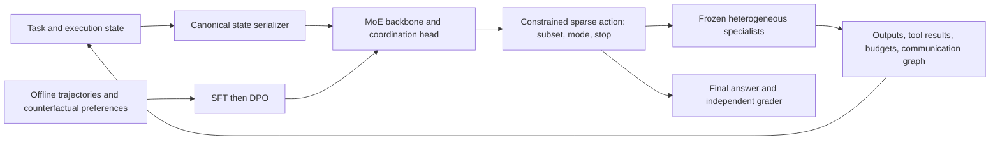

# Architecture and experimental boundary

There are two different kinds of sparsity. **Internal expert top-k** selects
neural experts inside the MoE. **Agent top-k** caps the number of specialists
activated per coordination step. They are independent configuration parameters.
The controller predicts a distribution over valid joint actions: an unordered
agent subset, sequential or parallel execution, and termination. Confidence is
the selected action probability, not a calibrated task-success estimate.

The development backend is a small, randomly initialized sparse neural MoE.
It tests infrastructure and objectives without downloading model weights. It
does not establish that a pretrained language model learns coordination.
The Hugging Face backend loads a configurable pretrained MoE, pools its state
representations, and adds a routing classifier. SFT updates the classifier and
optional LoRA adapters; DPO compares policy action log probabilities against
a frozen SFT reference. Specialist parameters never enter the optimizer.

Task answer keys belong to the independent grader and dataset records. Only
the public task and observed execution state enter model and specialist calls.
Training and preferences use training task IDs; held-out evaluation includes
compositions absent from the training task categories. Development specialists
perform bounded deterministic computation; their cheap timings do not predict
the relative economics of production LLM specialists.

All-Agent is deliberately exempt from the per-step sparse cap. Total token,
activation and coordination-round budgets otherwise remain constant. A prompting
supervisor must be supplied as a real frozen language model. Missing baselines
are reported as unavailable, never replaced with synthetic scores.
