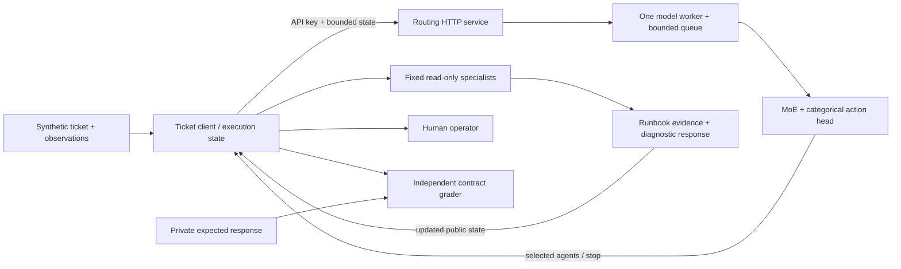

# GPU support triage: a reference customer scenario

## The problem

An HPC support team receives tickets about failed AI jobs. The first response
needs to distinguish an application problem from a host, driver, or container
problem, cite the evidence, and identify the next useful observation. A wrong
confident answer can waste an operator's time or encourage an unnecessary change
to a shared system.

This is a reference scenario, not a completed customer engagement. The included
tickets are synthetic, the specialists are fixed read-only tools, and the
diagnostic corpus is deliberately small. They make a useful integration example;
they do not establish enterprise troubleshooting accuracy.

The architectural question is practical: **does a learned coordinator earn its
place on this execution path?** Compare it with a small rule policy under the
same ticket inventory, specialist implementations, budgets, and answer contract.

## Requirements and boundaries

| Requirement | Demonstration boundary |
| --- | --- |
| Ground the answer | Return a structured diagnosis with evidence and a next action from the public runbook corpus. Insufficient evidence should produce an escalation. |
| Keep changes under operator control | No shell, cluster, driver, or container commands execute. The result is advice for a human operator. |
| Separate labels from execution | Private expected answers are used only by the independent grader, never by the controller or specialists. |
| Authenticate routing | The local demonstration uses an ephemeral API key, an isolated child service, and loopback HTTP. |
| Bound work | Enforce the checkpoint's action catalog, per-step agent k, total calls, request limits, and service admission. |
| Observe the request boundary | Preserve client elapsed time, server timings, HTTP status, routing decisions, and task outcomes separately. |
| Test concurrent demand | Replay public ticket states at concurrency one and four. These are short acceptance samples, not a production capacity forecast. |
| Define a latency objective | The default two-second p95 target is illustrative. A measured failure remains a failure; it is not silently relaxed. |

An external deployment also needs ticket redaction, ingress/TLS, secret rotation,
operational ownership, retention rules, and workload-specific capacity tests.
Those are requirements for a future deployment, not capabilities established by
the localhost demonstration.

## Request and deployment architecture

The controller makes coordination decisions. It does not own GPU administration
or invent the runbook response. Retrieval and synthesis have a dependency: the
research specialist consumes evidence produced by retrieval. Calling both in
parallel is therefore a different execution from calling them sequentially.
Independent ticket requests can still run concurrently through the service.

One service worker owns its model. Additional processes load additional copies;
adding web workers is not a free increase in model capacity. Queue admission and
timeouts bound delivery, but a timeout cannot interrupt a model invocation
already executing. See [deployment behavior](deployment.md).

## Compare policies before recommending one

The support rule policy is specific to this small runbook. It supplies a useful
control for whether the learned controller chooses the necessary tools in the
right order. It is not a general-purpose enterprise support system.

The tiny controller is the download-free integration path. The Granite
preference checkpoint is the separately completed pretrained experiment. Neither
was trained on these support tickets. The demonstration records how each
candidate behaves; it must not reinterpret the support workload as training data
or call a small result proof of broad generalization.

| Observation | Recommendation |
| --- | --- |
| Rules satisfy the diagnostic contract and the learned policy fails it | Keep rules on the demonstrated path; inspect learned routing in shadow mode. |
| Both satisfy the contract | Compare measured latency and work under the same load before adding the model dependency. |
| The response is valid JSON but the diagnosis is wrong | Fail the diagnostic gate. Schema validity is not correctness. |
| The service is healthy but p95 exceeds the configured target | Investigate queue wait, batch work, and client time independently. Do not promise the target. |
| A ticket is outside the public runbook | Ask for further evidence or escalate. Do not prescribe a host reset from a vague symptom. |

## Evidence and acceptance

Run the [demonstration](demo_walkthrough.md) to produce per-ticket trajectories,
machine-readable acceptance checks, and raw HTTP load samples. The
[recorded support demonstration](../results/support-demo/report.md) separates
diagnostic outcomes from service behavior and identifies the exact source and
checkpoint used.

The diagnostic grader checks a fixed canonical response contract. The tickets,
rules, corpus, and labels were designed together. A perfect rule score is a
fixture check, not an independently sampled customer accuracy estimate. Repeated
load requests add timing samples, not new independent diagnostic tasks.

## NVIDIA deployment path

The local controller runs on CPU. A target NVIDIA deployment should first verify
the driver/device and supported precision, reload the actual trained checkpoint,
and check action/numerical equivalence. Then measure synchronized forward work,
allocated/reserved memory, queue-inclusive latency, error rates, and end-to-end
agent execution on the proposed hardware. Existing CUDA events, NVTX ranges,
device preflight, SLURM scripts, and the NGC container recipe support that work;
they are not substitutes for executing it.

The coordination head predicts categorical actions rather than generated text.
The current serving implementation uses PyTorch directly. No TensorRT-LLM, NIM,
or other NVIDIA inference-platform integration is claimed.

Public diagnostic references include NVIDIA's
[Container Toolkit troubleshooting](https://docs.nvidia.com/datacenter/cloud-native/container-toolkit/latest/troubleshooting.html),
[container capability and compatibility configuration](https://docs.nvidia.com/datacenter/cloud-native/container-toolkit/latest/docker-specialized.html),
and [Xid interpretation](https://docs.nvidia.com/deploy/xid-errors/introduction.html).
They support collecting discriminating evidence; an error string alone is not a
universal root-cause diagnosis.
