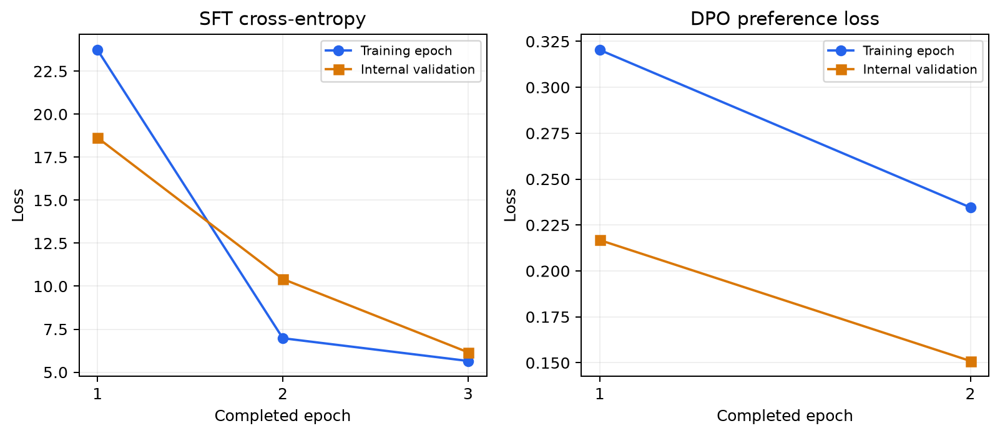
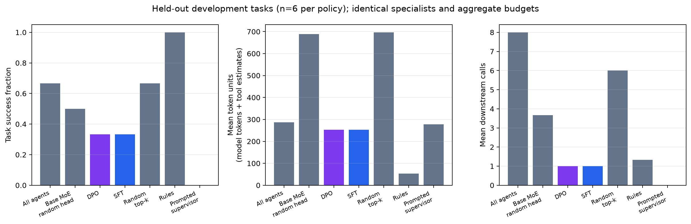

# Granite CPU pilot

Conductor asks whether coordinator-only post-training can improve the quality/cost
tradeoff of sparse multi-agent execution. This first experiment establishes that
the training and inference pipeline runs on a pinned pretrained MoE. It does
**not** establish an accuracy improvement or a batching speedup.

## Setup

The coordinator is `ibm-granite/granite-3.1-1b-a400m-base`, revision `408b6e90baab8cf24f4aa9f8e19703ffa0a53b29`, with
1,335,567,845 parameters including its action head.
Rank-4 LoRA adapts attention and expert-router projections; 942,565
parameters are trainable (0.07%). The base weights stay frozen. The 24-layer
backbone selects eight of 32 neural experts per token; this is independent of
the external specialist cap k=2.

Execution uses CPU float32 with SDPA and a 128-token input cap on a Mac. The
recorded environment is Python 3.12.14, PyTorch 2.14.0, Transformers 4.57.6 and
PEFT 0.21.0. CUDA, NCCL, SLURM execution and the NVIDIA container remain unvalidated.
[Run records](provenance.json) retain each phase's actual source commit and seed.

Eight fixed deterministic specialists make development inexpensive and reproducible.
They cover planning, retrieval, research, coding, tools, criticism, verification
and arithmetic. They are outside the coordinator optimizer. These fixtures are
not a production LLM workload.

## Data and post-training

Eighteen synthetic tasks are split into 12 training and six held-out tasks.
All-Agent, Rule-Based and Random Top-K generate 54 reference trajectories: 36
training-task trajectories and 18 held-out trajectories. Generation records 51
successes and three failures. Those are data-generation outcomes, not trained-model
accuracy.

The training inventory has 72 SFT labels and 216 exact-state preference pairs,
including initial and later stopping decisions. A task-level internal split
reserves three training task IDs for validation, leaving nine for fitting.
Twelve dense steps exceed the sparse action budget and are excluded. Preference
replays use a fixed continuation, with 240 durably saved counterfactual trials.
The reward penalizes token units, activations and communication; its latency
weight is zero to avoid learning from noisy development timings.

| Stage | Fitting examples | Validation examples | Optimizer windows | Initial train loss | Final train loss | Final validation loss |
| --- | --- | --- | --- | --- | --- | --- |
| SFT | 54 | 18 | 42 | 30.8815 | 3.7073 | 6.1560 |
| DPO | 162 | 54 | 82 | 0.6931 | 0.1892 | 0.1510 |

SFT uses categorical cross-entropy; DPO uses chosen/rejected action log probabilities
relative to the exact frozen SFT checkpoint. Loss magnitudes are different
objectives. DPO's final validation pair-ranking accuracy is
92.6%; this measures preference ordering, not task success.
[Saved-tensor checks](verification/post_training_verification.json) observe updates
in attention/router adapters and the head. They do not independently audit every
frozen base tensor.



## Held-out task outcomes

All policies receive the same six task IDs, fixed specialists, k=2 and common
budgets: three rounds, 12 activations and 8,192 token units. All-Agent is exempt
from the per-step sparse cap. Base MoE uses the same pretrained backbone with an
untrained coordination head.

| Policy | Success | Mean activations | Mean wall s | p95 wall s |
| --- | --- | --- | --- | --- |
| All-Agent | 4/6 | 8.0000 | 0.0134 | 0.0266 |
| Base MoE (random head) | 3/6 | 3.6667 | 0.8687 | 0.8896 |
| Conductor-Preference | 2/6 | 1.0000 | 0.5500 | 0.5726 |
| Conductor-SFT | 2/6 | 1.0000 | 0.5518 | 0.5709 |
| Random Top-K | 4/6 | 6.0000 | 0.0101 | 0.0106 |
| Rule-Based | 6/6 | 1.3333 | 0.0094 | 0.0097 |
| Static Supervisor | 0/6 | 0.0000 | 2.6357 | 2.9581 |

SFT and DPO both route every held-out task to coder and then stop. Lower training
loss and stronger offline preference ranking do not transfer to better task
outcomes. A [label diagnostic](verification/supervision_diagnostics.json) found
two distinct successful first-action targets for every training initial state.
Whole-trajectory success filtering can retain unnecessary random-policy steps.
This is a plausible supervision weakness, not a proven cause of collapse.

The prompted supervisor is the actual frozen Qwen2.5-0.5B-Instruct model. It
returned invalid structured decisions on all six tasks and failed closed; its
result does not establish superiority over a reliable prompted supervisor.
The Rule-Based mapping has a strong task-type prior for these synthetic tasks.

The primary dense baseline calls every specialist in one parallel round.
Dependencies cannot use another specialist's output within that round. Two
additional sequential controls expose this limitation:

| Dense control | Success | Mean activations |
| --- | --- | --- |
| One sequential round | 6/6 | 8.0000 |
| Two sequential rounds | 5/6 | 12.0000 |

The one-round control uses a fixed capability order; the two-round control uses
registry order and exhausts its call budget after eight plus four activations.
They were added after inspecting the pilot and are sensitivity analyses.
Held-out compositions share synthetic template families with training. Six test
tasks are too few to establish broad generalization; all improvement claim gates
remain insufficient. Any follow-up tuning needs a new locked test set.



## Controller inference

Thirty CPU configurations produce 720 timed requests from eight replayed states
covering math, retrieval and code. Batch limits are one/four, concurrency
one/four and specialist k is one/two/three. Native offline batches and queued
individual/dynamic requests have separate arrival semantics. Request latency
includes queueing; stage profiles and profiler traces are separate diagnostics.

| Batch limit | Concurrency | Dynamic/single throughput | Dynamic/single p95 |
| --- | --- | --- | --- |
| 1 | 1 | 1.0069 | 0.5766 |
| 4 | 4 | 0.8427 | 1.1329 |
| 4 | 1 | 1.4535 | 0.4548 |
| 1 | 4 | 0.7004 | 1.5785 |

At batch limit four, concurrency four and k=2, dynamic batching lowers observed
throughput and raises p95. Ratios favorable at concurrency one cannot be
attributed to multi-request batching. Repeats are grouped within seeded randomized
configuration order, so host variation limits interpretation. No reliable CPU
batching gain is established. A 24-operation serialization microbenchmark also
shows no benefit; no matched end-to-end disabled-cache run is included.

The controller dominates wall time on these inexpensive deterministic tasks
(about 98% for SFT/DPO). HF input tokens are actual tokenizer counts; downstream
tool tokens are estimates. Zero configured prices mean monetary costs are
unknown. Fewer activations do not establish inference-cost savings. CUDA memory,
GPU timing, mixed-precision gains and KV-cache reuse are not measured here.

An actual trained-checkpoint HTTP smoke completes 8
authenticated requests in batches of two/four/two, rejects unauthenticated calls
with 401 and drains its queue. macOS cleanup reported one leftover semaphore;
this is not a leak-free teardown claim. Trained-model overload/deadline tests
remain pending; unit tests cover their admission/timer logic.

Merged export and reload preserve selected agents, mode and termination across
6 initial-state probes at k=1/2/3. Maximum reload logit drift is
0.00013542175; masked probability drift is
3.6948222e-13. Checks apply documented
absolute/relative tolerances, finite values and masked probability/argmax gates.
The on-disk source checkpoint remains unchanged. A preceding copy attempt was
interrupted under memory pressure; an initial merge trial rejected numerical
drift and published nothing. These limited checks are not bitwise equivalence,
task correctness or a measured export speedup.

## Next experiment

Compare reward-filtered SFT targets and context/representation choices before
scaling. Then run multiple seeds with frozen LLM specialists, larger independent
task corpora and a locked test set. A real NVIDIA host must validate CUDA/NCCL,
the container, precision and serving paths, followed by matched inference
measurements. The research hypothesis remains unresolved.

## Evidence and reproduction

[Provenance](provenance.json), [sealed data](data/manifest.json),
[evaluation](phases/evaluation/metrics.json), [request timings](phases/inference/requests.csv),
[expert probes](phases/evaluation/initial_state_probe.json),
[HTTP smoke](phases/serving/metrics.json) and
[export checks](phases/export-verification/metrics.json) are retained.
The [export validation subset](phases/export-verification/validation.json) preserves
numerical fields and file hashes without the original host-specific model path.
Expert counts describe load changes on matched states; they do not establish
semantic specialization. Raw records preserve original working paths and commits.
Weights, optimizer/RNG state, console logs and the large profiler trace remain
local; [omission descriptors](omitted_artifacts.json) retain hashes for the latter
diagnostics. Metadata alone is not an executable checkpoint.

Regenerate model runs using `bash scripts/run_granite_pilot.sh` from the repository
root with the tested environment and fresh working outputs. Sequential controls,
HTTP smoke and export use the corresponding Granite configs and scripts. To
rebuild this report from its existing archive:

```bash
python scripts/report_pilot.py --archive results/granite-pilot
```
