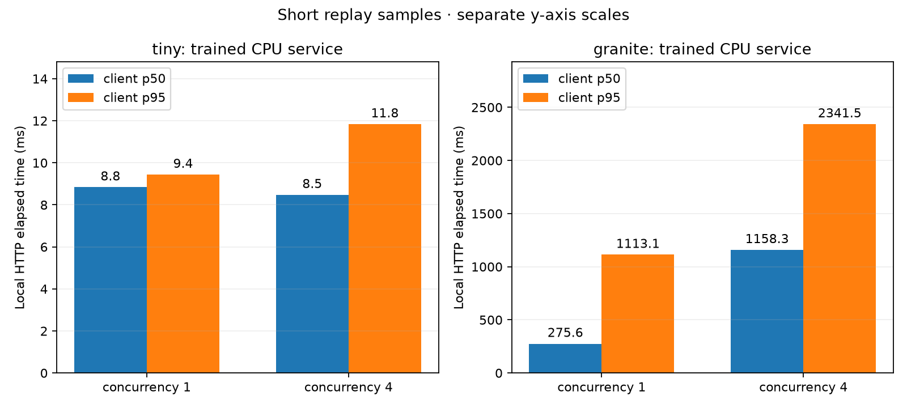

# Recorded support demonstration

This CPU demonstration connects actual trained-controller HTTP decisions to fixed,
read-only support specialists. Tickets and observations are synthetic. It tests
the execution loop and service boundary; it is not a customer deployment, an
independent diagnostic accuracy benchmark, or NVIDIA performance validation.

The rules, runbook, and expected responses were designed together. Diagnostic
success is an exact canonical-response match; contract validity separately
checks public evidence and read-only advice. Repeated HTTP samples do not add
independent diagnostic tasks.

## Diagnostic outcomes

| Run | Policy | Exact successes | Grounded contracts |
| --- | --- | --- | --- |
| tiny | support_http_model | 0/12 | 0/12 |
| tiny | support_rule_based | 12/12 | 12/12 |
| granite | support_http_model | 0/12 | 0/12 |
| granite | support_rule_based | 12/12 | 12/12 |

A valid routing response does not imply a correct diagnostic response.
The learned policy is a shadow candidate if diagnostic acceptance fails; the
rule control remains the recommendation for this fixed demonstration corpus.

## HTTP load samples

Each phase replays positive-budget public states through the warmed service.
Client p50/p95 include local HTTP and server queue wait, and exclude waiting
for a load-generator concurrency slot. Dispatch attempts/second includes
failed/cancelled attempts; successful completion throughput is retained
separately in raw metrics. These short samples are not a sustained capacity test.

| Run | Concurrency | Successful / attempted | Failures | Dispatch attempts/s | Client p50 (ms) | Client p95 (ms) |
| --- | --- | --- | --- | --- | --- | --- |
| tiny | 1 | 24/24 | 0 | 105.720 | 8.838 | 9.437 |
| tiny | 4 | 24/24 | 0 | 407.346 | 8.476 | 11.838 |
| granite | 1 | 24/24 | 0 | 2.406 | 275.552 | 1113.132 |
| granite | 4 | 24/24 | 0 | 3.123 | 1158.266 | 2341.480 |

## Acceptance and recommendation

### tiny

- Service-boundary checks: **pass**.
- Model diagnostic gate: **fail**.
- Configured HTTP load gates: **pass**.
- Recorded recommendation: `shadow_candidate`.
- Illustrative targets: `{"load_client_p95_seconds": 2.0, "maximum_load_failure_rate": 0.0, "minimum_model_success_rate": 1.0}`.

Inspect [tiny/service_acceptance.json](tiny/service_acceptance.json) and [tiny/metrics.json](tiny/metrics.json) for the individual checks.

### granite

- Service-boundary checks: **pass**.
- Model diagnostic gate: **fail**.
- Configured HTTP load gates: **fail**.
- Recorded recommendation: `shadow_candidate`.
- Illustrative targets: `{"load_client_p95_seconds": 2.0, "maximum_load_failure_rate": 0.0, "minimum_model_success_rate": 1.0}`.

Inspect [granite/service_acceptance.json](granite/service_acceptance.json) and [granite/metrics.json](granite/metrics.json) for the individual checks.

The targets are configured examples, not an achieved customer SLA. The service
checks cover the recorded local boundary. They do not demonstrate trained-GPU
overload recovery, kernel cancellation, external ingress, or all operational failures.

## Latency figure



The panels use separate y-axis scales so the tiny controller's millisecond timings remain visible.
The figure compares different checkpoints and repeated public states. It does
not isolate a batching improvement: no matched individual-inference ablation
is present in this demonstration. Use the separate research inference benchmark
for that comparison.

## Provenance

- **tiny:** [e0c40cf5da2c](https://github.com/darshgarg7/Conductor/commit/e0c40cf5da2c541e1f4e7241f26ec1c4a68a4c17), seed 42, clean source `True`, backend `tiny`, stage `sft`, pretrained `False`.
- **granite:** [e0c40cf5da2c](https://github.com/darshgarg7/Conductor/commit/e0c40cf5da2c541e1f4e7241f26ec1c4a68a4c17), seed 42, clean source `True`, backend `hf`, stage `preference`, pretrained `True`.

Each raw run records task-inventory, public-runbook, specialist, combined
workload, and checkpoint hashes. `specialist_audit.json` preserves the frozen
tool identities. The archive validator checks raw scores, task coverage, public
state fields, frozen identities, load percentiles, and service-check consistency.
These checks establish artifact consistency, not independent authentication.

Raw JSON/JSONL/CSV are copied byte-for-byte. `checksums.json` inventories the
published files; `provenance.json` records hashes of omitted local server logs
and resolved serving files. Secrets and model weights are not published.

Regenerate a fresh archive with:

```bash
python scripts/report_support_demo.py \
  --run tiny=outputs/demos/support-tiny \
  --run granite=outputs/demos/support-granite \
  --output outputs/reports/support-demo
```

See the [customer scenario](../../docs/customer_case_study.md),
[walkthrough](../../docs/demo_walkthrough.md), and
[operations guide](../../docs/support_operations.md) for the architecture and limits.
